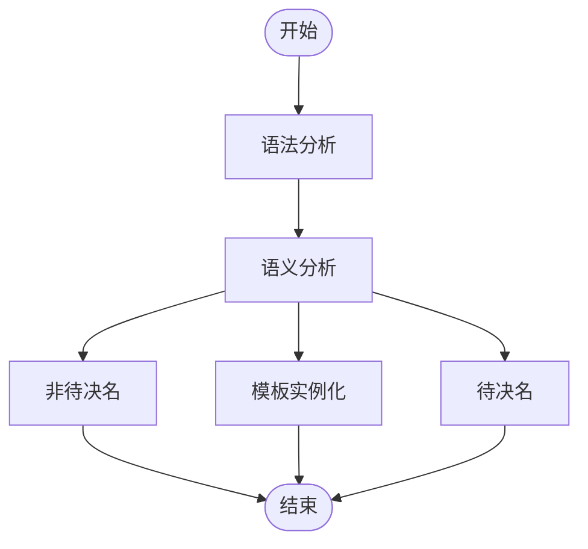

# 第一章
## tuple 包装没有拷贝的类
std::tuple<MyClass> tup(obj);  // ❌ 这里要求拷贝构造

std::ref(x) 返回的是一个轻量对象 std::reference_wrapper<T>，它内部只是存了一个指针或引用 —— 它不会拷贝 x 本身。
```
    std::tuple<std::reference_wrapper<Args>...> m_args;
```
reference_wrapper 其实保存的是一个指针,所以获取值的时候要用get()

## CTAD/函数模板
函数的万能引用是因为函数调用是一瞬间有效的,他的推导具有隔离性,而类则不同,会违背C++的基本原则:生成确定性原则

## EBO基类优化
空基类被继承会优化掉原本的1个字节(空类占用一个字节),而组合会占用指针字节

## unique_ptr作为成员
此时类的拷贝构造是delete的,其子类也不应该有拷贝

## 模板类的函数不依赖模板参数
由于不依赖模板参数,跟T无任何关系,所以他必须可用(属于非待决名,在编译时的语义分析阶段会立刻查找),必须用this->getValue();进行调用
两阶段查找和延迟实例化机制
- 待决名,无需知道类型是否完整
- 实例化,如果类型仍不完整报错


加了this 就依赖了模板类型参数,属于待决名,

## 存在引用
就会有生命周期依赖的问题

# 第二章
## 观察者模式
观察者容器,注意我们定义的类型是Reaction的不同变参的类型,即每个类型都不同.

## 类型擦除
类型擦除是一种常见的编程技术，它允许你在保持类型安全的前提下，处理多种不同类型的数据，而无需在编译时知道这些类型的具体信息。

## 折叠表达式!=参数包展开
弃值表达式,使用副作用,逗号表示式左折叠和右折叠都是无影响的,因为逗号表达式自己有顺序,C++17使用std::initializer_list实现

## 类型萃取+别名传递
具备更强大的类型适配能力

## 数据源的区分
使用成员变量区分?那是运行时开销,故而模仿迭代器的类型,使用Tag进行类型区分.
